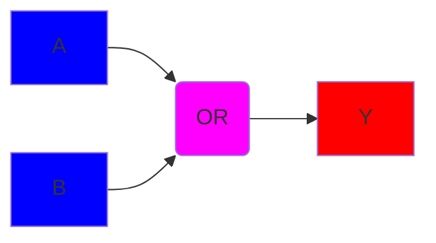
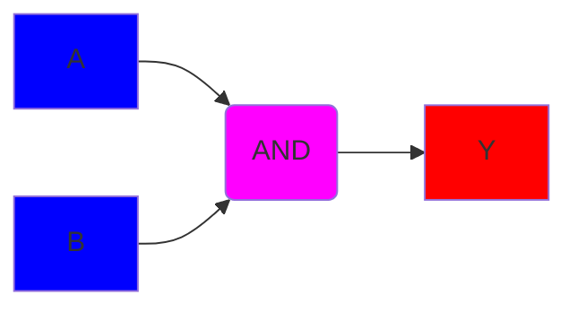
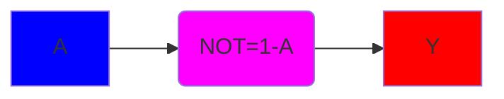

```mermaid

flowchart LR
A --> F(OR)
B --> F(OR)
F --> Y 
style A fill:#0000ff
style B fill:#0000ff
style Y fill:#ff0000
style F fill:#ff00ff 

```
A | B | Y = OR(A,B)
---|---|---
0 | 0 | 0
0 | 1 | 1
1 | 0 | 1
1 | 1 | 1

```mermaid

flowchart LR
A --> F(AND)
B --> F(AND)
F --> Y 
style A fill:#0000ff
style B fill:#0000ff
style Y fill:#ff0000
style F fill:#ff00ff 

```

A | B | Y = AND(A,B)
---|---|---
0 | 0 | 0
0 | 1 | 0
1 | 0 | 0
1 | 1 | 1

```mermaid

flowchart LR
A --> F(NOT=1-A) 
F --> Y 
style A fill:#0000ff
style Y fill:#ff0000
style F fill:#ff00ff 

```

A | Y = NOT(A)
---|---
0 | 1
1 | 0
