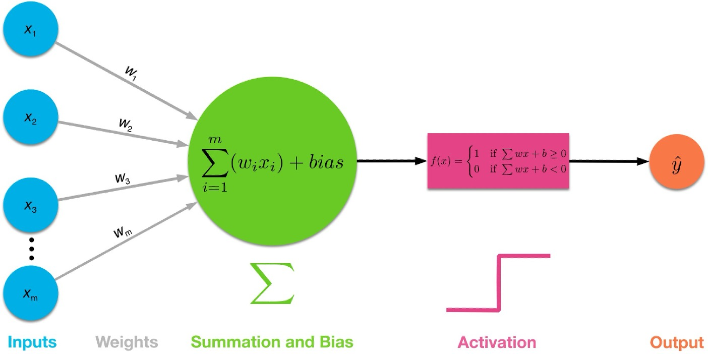
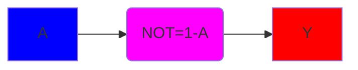

## OR

A | B | Y = OR(A,B)
---|---|---
0 | 0 | 0
0 | 1 | 1
1 | 0 | 1
1 | 1 | 1

```python
bias=0
threshold=1.0
```

x0 | x1 | w0 | w1 | x0*w0+x1*w1 | y_predicted | y_wanted
---|---|---|---|---|---|---
0 | 0 | 1.0 | 1.0 | 0.0 | 0 |  0
0 | 1 | 1.0 | 1.0 | 1.0 | 1 |  1
1 | 0 | 1.0 | 1.0 | 1.0 | 1 |  1
1 | 1 | 1.0 | 1.0 | 2.0 | 1 |  1

## AND

A | B | Y = AND(A,B)
---|---|---
0 | 0 | 0
0 | 1 | 0
1 | 0 | 0
1 | 1 | 1

```python
bias=0
threshold=1.0
```

x0 | x1 | w0 | w1 | x0*w0+x1*w1 | y_predicted | y_wanted
---|---|---|---|---|---|---
0 | 0 | 0.7 | 0.8 | 0.0 | 0 |  0
0 | 1 | 0.7 | 0.8 | 0.8 | 0 |  0
1 | 0 | 0.7 | 0.8 | 0.7 | 0 |  0
1 | 1 | 0.7 | 0.8 | 1.5 | 1 |  1



A | Y = NOT(A)
---|---
0 | 1
1 | 0
